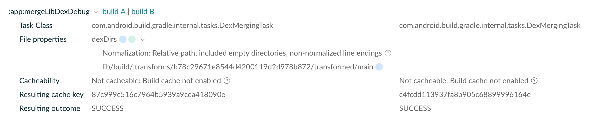

# DexDirs issue
Reproducing issue of DexDirs when applying AGP and a custom task generating new classes output dirs

## Steps
1. Download repo
2. ./gradlew clean assembleDebug
3. ./gradlew assembleDebug

Results:

